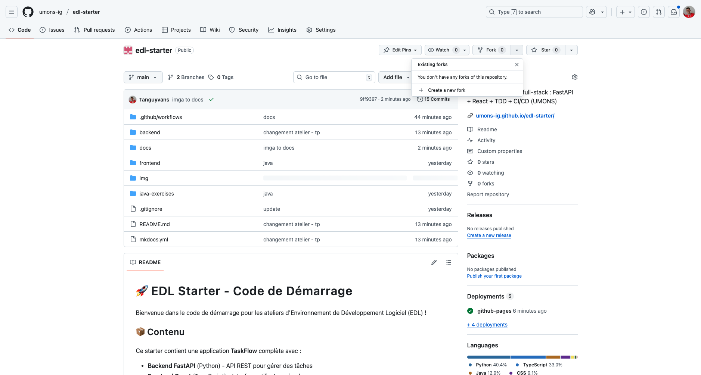

# 🎓 Atelier 1 : Tests Unitaires Backend & Frontend

**Objectif :** Apprendre les tests unitaires avec Python (pytest) et TypeScript (Vitest)

---

## Phase 1 : Installation & Configuration (30 min)

### Étape 1.1 : Forker le Dépôt

1. Allez sur `https://github.com/umons-ig/edl-starter`
2. Cliquez sur **"Fork"**

   

3. Clonez votre fork :

   ```bash
   git clone https://github.com/VOTRE_NOM/edl-starter
   cd edl-starter
   ```

### Étape 1.2 : Installer les Dépendances Python (2 Options)

**Option A : Avec UV (Recommandé - Plus Rapide) ⚡**

UV est un gestionnaire de paquets Python moderne et ultra-rapide.

**Installation UV :**

*macOS/Linux :*

```bash
curl -LsSf https://astral.sh/uv/install.sh | sh
```

*Windows :*

```powershell
powershell -c "irm https://astral.sh/uv/install.ps1 | iex"
```

**Installer les dépendances :**

```bash
cd backend
uv venv
source .venv/bin/activate  # Windows: .venv\Scripts\activate
uv sync
```

---

**Option B : Avec pip (Classique) 🐍**

Si vous préférez pip ou avez déjà Python installé :

```bash
cd backend
python -m venv .venv
source .venv/bin/activate  # Windows: .venv\Scripts\activate
pip install -r requirements.txt
```
---

**Dans le reste de l'atelier :**

- Si vous utilisez **UV** : `uv run pytest`
- Si vous utilisez **pip** : `pytest`

---

## Phase 2 : Explorer l'Application

### Étape 2.1 : Lancer le Serveur

```bash
uv run uvicorn src.app:app --reload
```

### Étape 2.2 : Tester dans le Navigateur

Visitez :

- **API :** <http://localhost:8000>
- **Documentation interactive :** <http://localhost:8000/docs>
- **Santé :** <http://localhost:8000/health>

### Étape 2.3 : Tester avec Swagger UI

1. Allez sur <http://localhost:8000/docs>
2. Cliquez sur **POST /tasks**
3. Cliquez sur **"Try it out"**
4. Entrez :

   ```json
   {
     "title": "Ma première tâche",
     "description": "Apprendre FastAPI"
   }
   ```

5. Cliquez sur **"Execute"**
6. Vous devriez voir un code `201 Created`

### Étape 2.4 : Explorer le Code

Ouvrez `backend/src/app.py` dans votre éditeur :

- **Lignes 27-36 :** Énumérations (TaskStatus, TaskPriority)
- **Lignes 39-68 :** Modèles Pydantic
- **Lignes 76-77 :** Stockage en mémoire (dictionnaire simple)
- **Lignes 180-205 :** Endpoint pour créer une tâche
- **Lignes 144-160 :** Endpoint pour lister les tâches

**Important :** Ce backend utilise un **stockage en mémoire** (un simple dictionnaire Python) pour Atelier 1 & 2. Vous apprendrez à utiliser PostgreSQL dans l'Atelier 3.

---

## Phase 3 : Comprendre les Tests

### Étape 3.1 : Explorer les Fichiers de Test

Ouvrez ces fichiers :

- `backend/tests/conftest.py` → Fixtures de test
- `backend/tests/test_api.py` → Tests

### Étape 3.2 : Qu'est-ce qu'une Fixture ?

Dans `conftest.py`, regardez :

```python
@pytest.fixture(autouse=True)
def clean_tasks():
    """Nettoie les tâches avant et après chaque test"""
    clear_tasks()
    yield
    clear_tasks()

@pytest.fixture
def client():
    """Fournit un client HTTP de test"""
    with TestClient(app) as test_client:
        yield test_client
```

**Pourquoi c'est utile ?**

- `clean_tasks` : Nettoie automatiquement le stockage en mémoire avant chaque test
- `client` : Vous n'avez pas à créer un client dans chaque test
- pytest les injecte automatiquement quand vous écrivez `def test_xxx(client):`

### Étape 3.3 : Lancer les Tests Existants

```bash
uv run pytest -v
```

Vous devriez voir :

```text
tests/test_api.py::test_root_endpoint PASSED
tests/test_api.py::test_health_check PASSED
tests/test_api.py::test_create_task PASSED
tests/test_api.py::test_list_tasks PASSED
tests/test_api.py::test_get_task_by_id PASSED
... (19 tests au total)

========== 19 passed in 0.45s ==========
```

### Étape 3.4 : Comprendre un Test

Regardez `test_create_task` dans `test_api.py` :

```python
def test_create_task(client):
    # ARRANGE : Préparer les données
    new_task = {
        "title": "Acheter des courses",
        "description": "Lait, œufs, pain"
    }

    # ACT : Faire la requête
    response = client.post("/tasks", json=new_task)

    # ASSERT : Vérifier
    assert response.status_code == 201
    assert response.json()["title"] == "Acheter des courses"
```

**Pattern Arrange-Act-Assert :**

1. **Arrange** → Préparer
2. **Act** → Agir
3. **Assert** → Vérifier

---

## Phase 4 : Implémenter les Fonctions Backend

### ✍️ Exercice 1 : Implémenter `delete_task()`

**🎯 Objectif :** Compléter la fonction `delete_task()` dans `backend/src/app.py`

Ouvrez `backend/src/app.py` et trouvez la fonction `delete_task()` (ligne ~240).

**Les tests existent déjà !** Regardez dans `test_api.py` :

- `test_delete_task` : Supprime une tâche et vérifie qu'elle a disparu
- `test_delete_nonexistent_task` : Vérifie le 404

**Votre mission :**

Implémentez les 3 étapes décrites dans le TODO :

```python
@app.delete("/tasks/{task_id}", status_code=204)
async def delete_task(task_id: int):
    # TODO: Votre code ici
    # 1. Vérifier que la tâche existe
    # 2. La supprimer de tasks_db
    # 3. Retourner None
```

**Vérifier votre code :**

```bash
cd backend
uv run pytest tests/test_api.py::test_delete_task -v
```

✅ Si le test passe → **Bravo !**

❌ Si le test échoue → Lisez l'erreur et corrigez

---

### ✍️ Exercice 2 : Implémenter `update_task()`

**🎯 Objectif :** Compléter la fonction `update_task()` dans `backend/src/app.py`

Trouvez la fonction `update_task()` (ligne ~207).

**Les tests existent déjà !** Regardez :

- `test_update_task` : Change le titre d'une tâche
- `test_update_task_status` : Change le statut
- `test_update_nonexistent_task` : Vérifie le 404

**Votre mission :**

Implémentez les 7 étapes décrites dans le TODO.

**Indices :**

1. C'est similaire à `create_task` mais avec une tâche existante
2. Utilisez `updates.model_dump(exclude_unset=True)` pour obtenir les champs fournis
3. Utilisez `update_data.get("field", existing_task.field)` pour garder les anciennes valeurs si non mises à jour

**Vérifier votre code :**

```bash
uv run pytest tests/test_api.py::test_update_task -v
```

---

### ✍️ Exercice 3 : Écrire un Test de Suppression Inexistante (10 min)

**🎯 Objectif :** Tester qu'on ne peut pas supprimer une tâche qui n'existe pas

Ouvrez `backend/tests/test_api.py` et trouvez la section DELETE TASK TESTS.

Ajoutez ce test après `test_delete_task` :

```python
def test_delete_nonexistent_task_returns_404(client):
    """Deleting a task that doesn't exist should return 404."""
    # TODO: Votre code ici
    # 1. Essayer de supprimer une tâche avec un ID qui n'existe pas (ex: 9999)
    # 2. Vérifier que ça retourne 404
    # 3. Vérifier le message d'erreur contient "not found"
```

**Indice :** C'est un test d'erreur très simple - seulement 3-4 lignes de code !

**Vérifier :**

```bash
uv run pytest tests/test_api.py::test_delete_nonexistent_task_returns_404 -v
```

---

### ✍️ Exercice 4 : Écrire un Test de Validation (10 min)

**🎯 Objectif :** Tester qu'on ne peut pas mettre à jour une tâche avec une priorité invalide

Ouvrez `backend/tests/test_api.py` et trouvez la fonction `test_update_task_with_invalid_priority`.

**Votre mission :**

Implémentez ce test en suivant les étapes dans les commentaires :

```python
def test_update_task_with_invalid_priority(client):
    """Updating a task with an invalid priority should fail."""
    # TODO: Votre code ici
    # 1. Créer une tâche valide
    # 2. Essayer de la mettre à jour avec priority="urgent" (invalide)
    # 3. Vérifier que ça retourne 422 (Erreur de Validation)
```

**Rappel :** Les priorités valides sont `"low"`, `"medium"`, `"high"` (voir `TaskPriority` dans `app.py`)

**Vérifier :**

```bash
uv run pytest tests/test_api.py::test_update_task_with_invalid_priority -v
```

---

### ✍️ Exercice 5 : Écrire un Test de Filtrage (10 min)

**🎯 Objectif :** Tester le filtrage avec plusieurs critères

Ajoutez ce test dans la section FILTER TASKS TESTS :

```python
def test_filter_by_multiple_criteria(client):
    """Filtering by status AND priority should work."""
    # TODO: Votre code ici
    # 1. Créer 3 tâches avec différents status et priority
    # 2. Filtrer avec GET /tasks?status=todo&priority=high
    # 3. Vérifier qu'on reçoit seulement les bonnes tâches
```

**Vérifier :**

```bash
uv run pytest tests/test_api.py::test_filter_by_multiple_criteria -v
```

---

### Étape 4.6 : Lancer TOUS les Tests (5 min)

Une fois que vous avez terminé les 5 exercices, lancez tous les tests :

```bash
uv run pytest -v
```

**Résultat attendu :**

```text
tests/test_api.py::test_root_endpoint PASSED
tests/test_api.py::test_health_check PASSED
tests/test_api.py::test_create_simple_task PASSED
...
tests/test_api.py::test_delete_task PASSED
tests/test_api.py::test_update_task PASSED
tests/test_api.py::test_delete_nonexistent_task_returns_404 PASSED
tests/test_api.py::test_update_task_with_empty_title PASSED
tests/test_api.py::test_filter_by_multiple_criteria PASSED
...
========== 22+ passed in 0.5s ==========
```

🎉 **Tous les tests passent ?** Vous avez réussi !

---

## Phase 5 : Couverture de Code

### Étape 5.1 : Lancer les Tests avec Couverture

```bash
uv run pytest --cov
```

Résultat :

```text
---------- coverage: platform darwin, python 3.12.7 -----------
Name                Stmts   Miss  Cover
---------------------------------------
src/app.py            156      6    96%
---------------------------------------
TOTAL                 156      6    96%
```

**Note :** La couverture est très élevée (96%) car le backend est simple avec stockage en mémoire. Dans l'Atelier 3, vous ajouterez une base de données PostgreSQL.

### Étape 5.2 : Générer un Rapport HTML

```bash
uv run pytest --cov --cov-report=html
```

Ouvrir le rapport :

```bash
open htmlcov/index.html  # macOS
start htmlcov/index.html  # Windows
```

---

## Phase 6 : Tests Frontend

### Étape 6.1 : Comprendre le Frontend

Le frontend est une application **React + TypeScript** simple qui communique avec le backend.

**Structure :**

```
frontend/
├── src/
│   ├── App.tsx              # Composant principal
│   ├── App.css              # Styles simples
│   ├── api/
│   │   ├── api.ts           # Client API
│   │   └── api.test.ts      # Tests API ← ON TESTE ÇA
│   └── components/
│       ├── SimpleTaskList.tsx
│       └── TaskForm.tsx
└── package.json
```

**Important :** On teste **uniquement l'API** (pas les composants React) pour rester simple.

### Étape 6.2 : Installer les Dépendances Frontend

```bash
cd frontend
npm install
```

Cela va installer toutes les dépendances définies dans `package.json`.

### Étape 6.3 : Lancer les Tests Frontend

```bash
npm test
```

Vous devriez voir :

```
✓ src/api/api.test.ts (3 tests) 4ms
  ✓ fetches tasks from the backend
  ✓ creates a new task
  ✓ throws error when API fails

Test Files  1 passed (1)
     Tests  3 passed (3)
```

### Étape 6.4 : Analyser les Tests

Ouvrez `frontend/src/api/api.test.ts` :

```typescript
describe('API Module', () => {
  it('fetches tasks from the backend', async () => {
    // Mock fetch pour simuler la réponse
    (globalThis as any).fetch = vi.fn(() =>
      Promise.resolve({
        ok: true,
        json: () => Promise.resolve([
          { id: 1, title: 'Test Task', status: 'todo' }
        ]),
      })
    );

    const tasks = await api.getTasks();
    expect(tasks).toHaveLength(1);
    expect(tasks[0].title).toBe('Test Task');
  });
});
```

**Concepts clés :**

- **Mocking** : On simule `fetch()` pour ne pas appeler le vrai backend
- **async/await** : Tests asynchrones
- **expect()** : Assertions Vitest (similaire à pytest)

### Étape 6.5 : Couverture Frontend

```bash
npm run test:coverage
```

Résultat :

```
File       | % Stmts | % Branch | % Funcs | % Lines |
-----------|---------|----------|---------|---------|
api.ts     |   68.42 |    55.55 |      50 |   68.42 |
```

**Note :** On teste uniquement l'API (pas les composants React).

### Étape 6.6 : Comprendre un Test Existant

Avant d'écrire votre test, analysons comment fonctionne le test `creates a new task` :

```typescript
it('creates a new task', async () => {
  // 1. ARRANGE : Préparer les données
  const newTask = { title: 'New Task', status: 'todo' as const };

  // 2. ARRANGE : Mocker fetch pour simuler la réponse du backend
  (globalThis as any).fetch = vi.fn(() =>
    Promise.resolve({
      ok: true,
      json: () => Promise.resolve({ ...newTask, id: 1 }),
    })
  );

  // 3. ACT : Appeler la fonction à tester
  const created = await api.createTask(newTask);

  // 4. ASSERT : Vérifier les résultats
  expect(created.id).toBe(1);
  expect(created.title).toBe('New Task');
});
```

**Que fait ce test ?**

1. **Arrange** : Prépare les données (newTask) et mock fetch
2. **Act** : Appelle `api.createTask()`
3. **Assert** : Vérifie que la tâche créée a bien un ID et le bon titre

**Pattern AAA** - le même qu'en Python ! 🎯

---

### ✍️ Exercice 6 : Écrire un Test Frontend (10 min)

**🎯 Objectif :** Tester la fonction `deleteTask()` du module API

Ouvrez `frontend/src/api/api.test.ts` et trouvez le test marqué `it.todo(...)` :

```typescript
it.todo('deletes a task', async () => {
  // TODO: Votre code ici
  // 1. Mocker fetch pour simuler une suppression réussie (status: 204)
  // 2. Appeler await api.deleteTask(1)
  // 3. Vérifier que fetch a été appelé avec la bonne URL et méthode DELETE
});
```

**Votre mission :** Implémentez ce test en suivant les 3 étapes !

**Indice :** Regardez le test `creates a new task` juste au-dessus pour vous inspirer.

**Vérifier votre test :**

```bash
cd frontend
npm test
```

✅ Si le test passe → **Bravo !** Vous devriez voir **4 tests passed** au lieu de 3 !

❌ Si le test échoue → Lisez l'erreur et corrigez

---

### ✍️ Exercice 7 : Écrire un Test UPDATE Frontend (10 min)

**🎯 Objectif :** Tester la fonction `updateTask()` du module API

Dans `frontend/src/api/api.test.ts`, trouvez le deuxième test marqué `it.todo(...)` :

```typescript
it.todo('updates a task', async () => {
  // TODO: Votre code ici
  // 1. Mocker fetch pour simuler une mise à jour réussie
  // 2. Appeler await api.updateTask(1, { title: 'Updated Title' })
  // 3. Vérifier que fetch a été appelé avec la bonne URL, méthode PUT et body
});
```

**Votre mission :** Implémentez ce test en suivant les 3 étapes !

**Indices :**

1. C'est similaire au test DELETE, mais avec méthode `PUT` au lieu de `DELETE`
2. Il faut aussi vérifier le `body` contient les bonnes données
3. Le mock fetch doit retourner un objet avec `json()` (comme dans `creates a new task`)

**Vérifier votre test :**

```bash
npm test
```

✅ Si le test passe → **Bravo !** Vous devriez voir **5 tests passed** !

❌ Si le test échoue → Lisez l'erreur et corrigez

---

### Étape 6.7 : Vérifier la Couverture

```bash
npm run test:coverage
```

Résultat :

```
File       | % Stmts | % Branch | % Funcs | % Lines |
-----------|---------|----------|---------|---------|
api.ts     |   84.21 |    66.67 |   71.43 |   84.21 |
```

La couverture a augmenté grâce à vos tests ! 🎉

### Étape 6.8 : Lancer l'Application Complète

**Terminal 1 - Backend :**

```bash
cd backend
uv run uvicorn src.app:app --reload
```

**Terminal 2 - Frontend :**

```bash
cd frontend
npm install  # Si pas déjà fait
npm run dev
```

---

## 🎁 BONUS : Exercices Java

**Objectif :** Voir que les principes de TDD s'appliquent à tous les langages !

Les exercices Java sont dans le dossier [`java-exercises/`](../java-exercises/).

### Pourquoi Java en Bonus ?

Dans ce cours, on utilise **Python** pour le backend, mais les concepts de tests unitaires sont **universels** :

- Pattern **Arrange-Act-Assert**
- **Fixtures** (setup/teardown)
- **Assertions**
- **Couverture de code**

Les exercices Java vous montrent que ces principes fonctionnent de la même manière dans **tous les langages** !

### Exercices Disponibles

**3 exercices progressifs avec JUnit :**

1. **Calculator** (15 min) - Opérations arithmétiques simples
2. **StringUtils** (15 min) - Manipulation de chaînes de caractères
3. **BankAccount** (15 min) - Gestion de compte avec validation

**Chaque exercice contient :**

- ✅ Un test d'exemple (déjà implémenté)
- ❌ Des tests à compléter (marqués `@Test`)
- 🎯 Du code à implémenter (marqué `// TODO`)

### Configuration VSCode (5 min)

**Extensions requises :**

1. **Language Support for Java(TM) by Red Hat**
2. **Extension Pack for Java** (Microsoft)

Installez-les depuis VSCode : `Cmd+Shift+X` → Recherchez "Java"

**Voir le README complet :** [`java-exercises/README.md`](../java-exercises/README.md)

### Commencer les Exercices

```bash
# 1. Ouvrir le dossier dans VSCode
cd java-exercises
code .

# 2. Attendre que VSCode détecte les fichiers Java

# 3. Cliquer sur l'icône ▶️ à côté des tests
```

**Alternative (terminal) :**

```bash
cd java-exercises/calculator
javac -cp .:../lib/junit-4.13.2.jar:../lib/hamcrest-core-1.3.jar *.java
java -cp .:../lib/junit-4.13.2.jar:../lib/hamcrest-core-1.3.jar org.junit.runner.JUnitCore CalculatorTest
```
