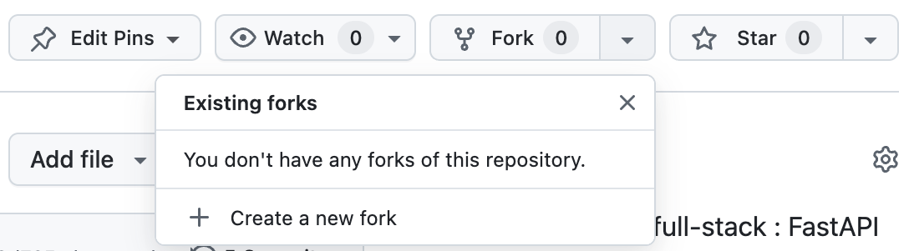
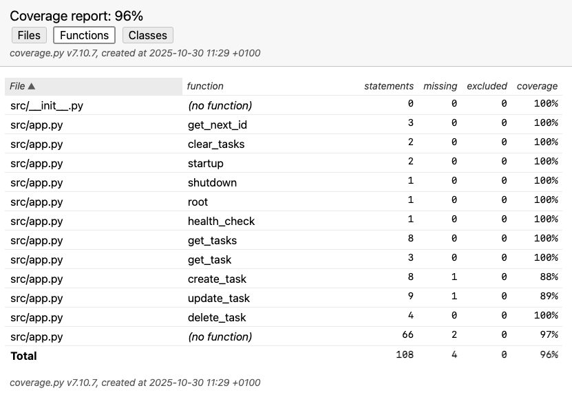

# 🎓 TP 1 : Tests Unitaires Backend & Frontend

**Objectif :** Apprendre les tests unitaires avec Python (pytest) et TypeScript (Vitest)

---

## Phase 1 : Installation & Configuration

### Étape 1.1 : Forker le Dépôt

1. Allez sur `https://github.com/umons-ig/edl-starter`
2. Cliquez sur **"Fork"**

   

3. Clonez votre fork :

   ```bash
   git clone https://github.com/VOTRE_NOM/edl-starter
   cd edl-starter
   ```

### Étape 1.2 : Installer les Dépendances Python (2 Options)

**Option A : Avec UV (Recommandé - Plus Rapide) ⚡**

UV est un gestionnaire de paquets Python moderne et ultra-rapide.

**Installation UV :**

*macOS/Linux :*

```bash
curl -LsSf https://astral.sh/uv/install.sh | sh
```

*Windows :*

```powershell
powershell -c "irm https://astral.sh/uv/install.ps1 | iex"
```

**Installer les dépendances :**

```bash
cd backend
uv venv
source .venv/bin/activate  # Windows: .venv\Scripts\activate
uv sync
```

---

**Option B : Avec pip (Classique) 🐍**

Si vous préférez pip ou avez déjà Python installé :

```bash
cd backend
python -m venv .venv
source .venv/bin/activate  # Windows: .venv\Scripts\activate
pip install -r requirements.txt
```

---

**Dans le reste de l'atelier :**

- Si vous utilisez **UV** : `uv run pytest`
- Si vous utilisez **pip** : `pytest`

---

## Phase 2 : Explorer l'Application

### Étape 2.1 : Lancer le Serveur

```bash
uv run uvicorn src.app:app --reload
```

### Étape 2.2 : Tester dans le Navigateur

Visitez :

- **API :** <http://localhost:8000>
- **Documentation interactive :** <http://localhost:8000/docs>
- **Santé :** <http://localhost:8000/health>

### Étape 2.3 : Tester avec Swagger UI

1. Allez sur <http://localhost:8000/docs>
2. Cliquez sur **POST /tasks**
3. Cliquez sur **"Try it out"**
4. Entrez :

   ```json
   {
     "title": "Ma première tâche",
     "description": "Apprendre FastAPI"
   }
   ```

5. Cliquez sur **"Execute"**
6. Vous devriez voir un code `201 Created`

### Étape 2.4 : Explorer le Code

Ouvrez `backend/src/app.py` dans votre éditeur :

- **Lignes 27-36 :** Énumérations (TaskStatus, TaskPriority)
- **Lignes 39-68 :** Modèles Pydantic
- **Lignes 76-77 :** Stockage en mémoire (dictionnaire simple)
- **Lignes 180-205 :** Endpoint pour créer une tâche
- **Lignes 144-160 :** Endpoint pour lister les tâches

**Important :** Ce backend utilise un **stockage en mémoire** (un simple dictionnaire Python) pour TP 1 & 2. Vous apprendrez à utiliser PostgreSQL dans l'TP 3.

---

## Phase 3 : Comprendre les Tests

### Étape 3.1 : Explorer les Fichiers de Test

Ouvrez ces fichiers :

- `backend/tests/conftest.py` → Fixtures de test
- `backend/tests/test_api.py` → Tests

### Étape 3.2 : Qu'est-ce qu'une Fixture ?

Dans `conftest.py`, regardez :

```python
@pytest.fixture(autouse=True)
def clean_tasks():
    """Nettoie les tâches avant et après chaque test"""
    clear_tasks()
    yield
    clear_tasks()

@pytest.fixture
def client():
    """Fournit un client HTTP de test"""
    with TestClient(app) as test_client:
        yield test_client
```

**Pourquoi c'est utile ?**

- `clean_tasks` : Nettoie automatiquement le stockage en mémoire avant chaque test
- `client` : Vous n'avez pas à créer un client dans chaque test
- pytest les injecte automatiquement quand vous écrivez `def test_xxx(client):`

### Étape 3.3 : Lancer les Tests Existants

```bash
uv run pytest -v
```

Vous devriez voir :

```text
tests/test_api.py::test_root_endpoint PASSED
tests/test_api.py::test_health_check PASSED
tests/test_api.py::test_create_task PASSED
tests/test_api.py::test_list_tasks PASSED
tests/test_api.py::test_get_task_by_id PASSED
... (19 tests au total)

========== 19 passed in 0.45s ==========
```

### Étape 3.4 : Comprendre un Test

Regardez `test_create_task` dans `test_api.py` :

```python
def test_create_task(client):
    # ARRANGE : Préparer les données
    new_task = {
        "title": "Acheter des courses",
        "description": "Lait, œufs, pain"
    }

    # ACT : Faire la requête
    response = client.post("/tasks", json=new_task)

    # ASSERT : Vérifier
    assert response.status_code == 201
    assert response.json()["title"] == "Acheter des courses"
```

**Pattern Arrange-Act-Assert :**

1. **Arrange** → Préparer
2. **Act** → Agir
3. **Assert** → Vérifier

---

## Phase 4 : Implémenter les Fonctions Backend

### ✍️ Exercice 1 : Implémenter `delete_task()`

**🎯 Objectif :** Compléter la fonction `delete_task()` dans `backend/src/app.py`

Ouvrez `backend/src/app.py` et trouvez la fonction `delete_task()` (ligne ~240).

**Les tests existent déjà !** Regardez dans `test_api.py` :

- `test_delete_task` : Supprime une tâche et vérifie qu'elle a disparu
- `test_delete_nonexistent_task` : Vérifie le 404

**Votre mission :**

Implémentez les 3 étapes décrites dans le TODO :

```python
@app.delete("/tasks/{task_id}", status_code=204)
async def delete_task(task_id: int):
    # TODO: Votre code ici
    # 1. Vérifier que la tâche existe
    # 2. La supprimer de tasks_db
    # 3. Retourner None
```

**Vérifier votre code :**

```bash
cd backend
uv run pytest tests/test_api.py::test_delete_task -v
```

✅ Si le test passe → **Bravo !**

❌ Si le test échoue → Lisez l'erreur et corrigez

---

### ✍️ Exercice 2 : Implémenter `update_task()`

**🎯 Objectif :** Compléter la fonction `update_task()` dans `backend/src/app.py`

Trouvez la fonction `update_task()` (ligne ~207).

**Les tests existent déjà !** Regardez :

- `test_update_task` : Change le titre d'une tâche
- `test_update_task_status` : Change le statut
- `test_update_nonexistent_task` : Vérifie le 404

**Votre mission :**

Implémentez les 7 étapes décrites dans le TODO.

**Indices :**

1. C'est similaire à `create_task` mais avec une tâche existante
2. Utilisez `updates.model_dump(exclude_unset=True)` pour obtenir les champs fournis
3. Utilisez `update_data.get("field", existing_task.field)` pour garder les anciennes valeurs si non mises à jour

**Vérifier votre code :**

```bash
uv run pytest tests/test_api.py::test_update_task -v
```

---

### ✍️ Exercice 3 : Écrire un Test de Suppression Inexistante

**🎯 Objectif :** Tester qu'on ne peut pas supprimer une tâche qui n'existe pas

Ouvrez `backend/tests/test_api.py` et trouvez la section DELETE TASK TESTS.

Ajoutez ce test après `test_delete_task` :

```python
def test_delete_nonexistent_task_returns_404(client):
    """Deleting a task that doesn't exist should return 404."""
    # TODO: Votre code ici
    # 1. Essayer de supprimer une tâche avec un ID qui n'existe pas (ex: 9999)
    # 2. Vérifier que ça retourne 404
    # 3. Vérifier le message d'erreur contient "not found"
```

**Indice :** C'est un test d'erreur très simple - seulement 3-4 lignes de code !

**Vérifier :**

```bash
uv run pytest tests/test_api.py::test_delete_nonexistent_task_returns_404 -v
```

---

### ✍️ Exercice 4 : Écrire un Test de Validation

**🎯 Objectif :** Tester qu'on ne peut pas mettre à jour une tâche avec une priorité invalide

Ouvrez `backend/tests/test_api.py` et trouvez la fonction `test_update_task_with_invalid_priority`.

**Votre mission :**

Implémentez ce test en suivant les étapes dans les commentaires :

```python
def test_update_task_with_invalid_priority(client):
    """Updating a task with an invalid priority should fail."""
    # TODO: Votre code ici
    # 1. Créer une tâche valide
    # 2. Essayer de la mettre à jour avec priority="urgent" (invalide)
    # 3. Vérifier que ça retourne 422 (Erreur de Validation)
```

**Rappel :** Les priorités valides sont `"low"`, `"medium"`, `"high"` (voir `TaskPriority` dans `app.py`)

**Vérifier :**

```bash
uv run pytest tests/test_api.py::test_update_task_with_invalid_priority -v
```

---

### ✍️ Exercice 5 : Écrire un Test de Filtrage

**🎯 Objectif :** Tester le filtrage avec plusieurs critères

Ajoutez ce test dans la section FILTER TASKS TESTS :

```python
def test_filter_by_multiple_criteria(client):
    """Filtering by status AND priority should work."""
    # TODO: Votre code ici
    # 1. Créer 3 tâches avec différents status et priority
    # 2. Filtrer avec GET /tasks?status=todo&priority=high
    # 3. Vérifier qu'on reçoit seulement les bonnes tâches
```

**Vérifier :**

```bash
uv run pytest tests/test_api.py::test_filter_by_multiple_criteria -v
```

---

### Étape 4.6 : Lancer TOUS les Tests

Une fois que vous avez terminé les 5 exercices, lancez tous les tests :

```bash
uv run pytest -v
```

**Résultat attendu :**

```text
tests/test_api.py::test_root_endpoint PASSED
tests/test_api.py::test_health_check PASSED
tests/test_api.py::test_create_simple_task PASSED
...
tests/test_api.py::test_delete_task PASSED
tests/test_api.py::test_update_task PASSED
tests/test_api.py::test_delete_nonexistent_task_returns_404 PASSED
tests/test_api.py::test_update_task_with_empty_title PASSED
tests/test_api.py::test_filter_by_multiple_criteria PASSED
...
========== 22+ passed in 0.5s ==========
```

🎉 **Tous les tests passent ?** Vous avez réussi !

---

## Phase 5 : Couverture de Code

### Étape 5.1 : Lancer les Tests avec Couverture

```bash
uv run pytest --cov
```

Résultat :

```text
---------- coverage: platform darwin, python 3.12.7 -----------
Name                Stmts   Miss  Cover
---------------------------------------
src/app.py            156      6    96%
---------------------------------------
TOTAL                 156      6    96%
```

**Note :** La couverture est très élevée (96%) car le backend est simple avec stockage en mémoire. Dans l'TP 3, vous ajouterez une base de données PostgreSQL.



### Étape 5.2 : Générer un Rapport HTML

```bash
uv run pytest --cov --cov-report=html
```

Ouvrir le rapport :

```bash
open htmlcov/index.html  # macOS
start htmlcov/index.html  # Windows
```

---

## Phase 6 : Tests Frontend

### Étape 6.1 : Comprendre le Frontend et Pourquoi Tester

Le frontend est une application **React + TypeScript** simple qui communique avec le backend.

**Structure :**

```
frontend/
├── src/
│   ├── App.tsx              # Composant principal
│   ├── App.css              # Styles simples
│   ├── api/
│   │   ├── api.ts           # Client API
│   │   └── api.test.ts      # Tests API ← ON TESTE ÇA
│   └── components/
│       ├── SimpleTaskList.tsx
│       └── TaskForm.tsx
└── package.json
```

#### 🤔 Pourquoi Tester le Frontend ?

**1. Vérifier la Communication avec le Backend**

Les tests frontend vérifient que votre code JavaScript/TypeScript communique correctement avec l'API backend :

- ✅ Les requêtes HTTP sont-elles correctement formées ? (bonne URL, bonne méthode, bon format)
- ✅ Les données sont-elles correctement envoyées ? (body JSON valide)
- ✅ Les réponses sont-elles correctement traitées ? (parsing JSON, extraction des données)
- ✅ Les erreurs sont-elles gérées ? (404, 500, network errors)

**2. Tester Sans Dépendre du Backend**

Grâce au **mocking**, on peut tester le frontend même si :

- ❌ Le backend n'est pas encore développé
- ❌ Le backend est en panne
- ❌ On n'a pas de connexion Internet
- ❌ On veut tester des cas d'erreur difficiles à reproduire

**Exemple :** Comment tester une erreur 500 sans crasher votre vrai backend ? → Avec un mock !

**3. Tests Rapides et Fiables**

- ⚡ **Rapides** : Pas besoin de lancer un vrai serveur
- 🔒 **Isolés** : Pas d'effets de bord entre les tests
- 🎯 **Précis** : On teste uniquement la logique frontend

#### 📦 Qu'est-ce qu'on Teste ?

Dans cet atelier, on teste **uniquement le module API** (`api.ts`), pas les composants React.

**Pourquoi ne pas tester les composants React ?**

- Les tests de composants React nécessitent des outils supplémentaires (React Testing Library)
- C'est plus complexe (gestion du DOM, événements, état)
- Pour l'TP 1, on se concentre sur les **concepts de base des tests**

**Ce qu'on teste dans `api.ts` :**

| Fonction | Ce qu'elle fait | Ce qu'on vérifie |
|----------|-----------------|------------------|
| `getTasks()` | Récupère la liste des tâches | Retourne un tableau de tâches |
| `createTask()` | Crée une nouvelle tâche | Envoie les bonnes données en POST |
| `deleteTask()` | Supprime une tâche | Appelle DELETE avec le bon ID |
| `updateTask()` | Met à jour une tâche | Envoie PUT avec les modifications |

#### 🎭 Le Concept de Mocking

**Problème :** Comment tester du code qui appelle une API externe ?

**Solution :** On **simule** (mock) la fonction `fetch()` pour qu'elle retourne ce qu'on veut !

```typescript
// Au lieu d'appeler le vrai backend...
fetch('http://localhost:8000/tasks')

// ...on remplace fetch par une fausse version qui retourne ce qu'on veut
(globalThis as any).fetch = vi.fn(() =>
  Promise.resolve({
    ok: true,
    json: () => Promise.resolve([{ id: 1, title: 'Test' }])
  })
);
```

**Avantages :**

- ✅ Pas besoin du vrai backend
- ✅ Contrôle total sur les réponses (succès, erreurs, cas limites)
- ✅ Tests ultra-rapides

#### 🔬 Décorticage Ligne par Ligne du Mock

Analysons en détail ce code de mocking qui peut sembler complexe au premier abord :

```typescript
(globalThis as any).fetch = vi.fn(() =>
  Promise.resolve({
    ok: true,
    json: () => Promise.resolve([
      { id: 1, title: 'Test Task', status: 'todo' }
    ]),
  })
);
```

**Ligne 1 : Remplacer la vraie fonction `fetch()`**

```typescript
(globalThis as any).fetch = vi.fn(...)
```

| Élément | Explication |
|---------|-------------|
| `globalThis` | Objet JavaScript global (équivalent de `window` dans le navigateur) |
| `.fetch` | La vraie fonction qui fait les requêtes HTTP |
| `vi.fn(...)` | Crée une fonction "espion" (mock) de Vitest |
| `(globalThis as any)` | TypeScript : on force le type pour pouvoir modifier fetch |

**Ce qu'on fait :** On remplace la vraie `fetch()` par une fausse version qu'on contrôle !

**Ligne 2 : Simuler une Promesse réussie**

```typescript
Promise.resolve({...})
```

- `fetch()` retourne toujours une **Promise** (asynchrone)
- `Promise.resolve()` simule une promesse qui **réussit immédiatement**
- On pourrait utiliser `Promise.reject()` pour simuler une erreur réseau

**Ligne 3-7 : Simuler la réponse HTTP**

```typescript
{
  ok: true,                    // ✅ Statut de la réponse
  json: () => Promise.resolve([...])  // 📦 Les données JSON
}
```

| Propriété | Valeur | Signification |
|-----------|--------|---------------|
| `ok` | `true` | La requête HTTP a réussi (status 200-299) |
| `ok` | `false` | La requête a échoué (status 400-599) |
| `json()` | Une fonction qui retourne une Promise | Simule `response.json()` |

**Pourquoi `json()` est une fonction ?**

Le vrai `fetch()` fonctionne comme ça :

```typescript
const response = await fetch('/tasks');  // Étape 1 : Obtenir la réponse
const data = await response.json();      // Étape 2 : Parser le JSON
```

Notre mock doit **imiter exactement ce comportement** !

**Ligne 4-6 : Les données retournées**

```typescript
[
  { id: 1, title: 'Test Task', status: 'todo' }
]
```

C'est le **tableau de tâches fictif** que notre mock va retourner. On peut mettre ce qu'on veut !

#### 🎨 Exemples de Mocks pour Différents Cas

**1️⃣ Mock pour un Succès (200 OK)**

```typescript
(globalThis as any).fetch = vi.fn(() =>
  Promise.resolve({
    ok: true,
    status: 200,
    json: () => Promise.resolve({ id: 1, title: 'Ma tâche' })
  })
);
```

**2️⃣ Mock pour une Erreur 404 (Not Found)**

```typescript
(globalThis as any).fetch = vi.fn(() =>
  Promise.resolve({
    ok: false,
    status: 404,
    statusText: 'Not Found'
  })
);
```

**3️⃣ Mock pour une Erreur 500 (Server Error)**

```typescript
(globalThis as any).fetch = vi.fn(() =>
  Promise.resolve({
    ok: false,
    status: 500,
    statusText: 'Server Error'
  })
);
```

**4️⃣ Mock pour une Erreur Réseau (pas de connexion)**

```typescript
(globalThis as any).fetch = vi.fn(() =>
  Promise.reject(new Error('Network error'))
);
```

#### ❓ Questions Fréquentes sur le Mocking

**Q : Pourquoi `(globalThis as any)` ?**

**R :** TypeScript protège `globalThis.fetch` contre les modifications. `as any` dit à TypeScript "Fais-moi confiance, je sais ce que je fais !" C'est normal dans les tests.

**Q : Pourquoi `vi.fn()` au lieu d'une fonction normale ?**

**R :** `vi.fn()` crée un **spy** (espion). On peut ensuite vérifier :

```typescript
expect(mockFetch).toHaveBeenCalledWith('/tasks/1', { method: 'DELETE' });
```

Avec une fonction normale, on ne pourrait pas faire ça !

**Q : Dois-je mocker `fetch()` dans chaque test ?**

**R :** **OUI !** Chaque test est isolé. Si vous ne mocker pas `fetch()`, le test essaiera d'appeler le vrai backend et échouera.

**Q : Le mock persiste-t-il entre les tests ?**

**R :** Non, Vitest réinitialise les mocks automatiquement entre chaque test. C'est pour garantir l'**isolation** des tests.

#### 🎯 Récapitulatif

| Concept | Signification |
|---------|---------------|
| **Mock** | Fausse version d'une fonction qu'on contrôle |
| `globalThis.fetch` | La vraie fonction HTTP qu'on remplace |
| `vi.fn()` | Crée un mock espion (peut être vérifié) |
| `Promise.resolve()` | Simule une promesse qui réussit |
| `ok: true` | Simule un succès HTTP (200-299) |
| `json()` | Fonction qui retourne les données JSON |

**Important :** On teste **uniquement l'API** (pas les composants React) pour rester simple.

### Étape 6.2 : Installer les Dépendances Frontend

```bash
cd frontend
npm install
```

Cela va installer toutes les dépendances définies dans `package.json`.

### Étape 6.3 : Lancer les Tests Frontend

```bash
npm test
```

Vous devriez voir :

```
✓ src/api/api.test.ts (3 tests) 4ms
  ✓ fetches tasks from the backend
  ✓ creates a new task
  ✓ throws error when API fails

Test Files  1 passed (1)
     Tests  3 passed (3)
```

### Étape 6.4 : Analyser les Tests en Détail

Ouvrez `frontend/src/api/api.test.ts` et analysons **ligne par ligne** comment fonctionne un test :

```typescript
describe('API Module', () => {
  it('fetches tasks from the backend', async () => {
    // ÉTAPE 1 : Mock fetch pour simuler la réponse du backend
    (globalThis as any).fetch = vi.fn(() =>
      Promise.resolve({
        ok: true,
        json: () => Promise.resolve([
          { id: 1, title: 'Test Task', status: 'todo' }
        ]),
      })
    );

    // ÉTAPE 2 : Appeler la fonction à tester
    const tasks = await api.getTasks();

    // ÉTAPE 3 : Vérifier les résultats
    expect(tasks).toHaveLength(1);
    expect(tasks[0].title).toBe('Test Task');
  });
});
```

#### 🔍 Explication Détaillée

**ÉTAPE 1 : Pourquoi mocker `fetch()` ?**

```typescript
(globalThis as any).fetch = vi.fn(() => ...)
```

- `globalThis.fetch` = la fonction JavaScript qui fait les requêtes HTTP
- `vi.fn()` = remplace fetch par une fausse version (mock) de Vitest
- On contrôle ce qu'elle retourne → **pas d'appel réseau réel**

**Ce que le mock retourne :**

```typescript
Promise.resolve({
  ok: true,                    // ✅ Requête réussie (pas d'erreur)
  json: () => Promise.resolve([...])  // Les données JSON à retourner
})
```

C'est exactement ce que le **vrai** `fetch()` retournerait, mais **sans réseau** !

**ÉTAPE 2 : Appeler la fonction**

```typescript
const tasks = await api.getTasks();
```

- Appelle la vraie fonction `getTasks()` de notre API
- Cette fonction utilise `fetch()` en interne
- Mais `fetch()` est maintenant notre **mock** → retourne instantanément les données fictives

**ÉTAPE 3 : Vérifier les résultats**

```typescript
expect(tasks).toHaveLength(1);       // ✅ On a bien reçu 1 tâche
expect(tasks[0].title).toBe('Test Task');  // ✅ Le titre est correct
```

#### 📊 Comparaison Backend vs Frontend

| Aspect | Tests Backend (pytest) | Tests Frontend (Vitest) |
|--------|------------------------|-------------------------|
| **Framework** | pytest | Vitest |
| **Langage** | Python | TypeScript |
| **Assertions** | `assert response.status_code == 200` | `expect(response.ok).toBe(true)` |
| **Mocking** | Fixtures (`client`) | `vi.fn()` |
| **Asynchrone** | Pas nécessaire (FastAPI le gère) | `async/await` obligatoire |
| **Pattern** | Arrange-Act-Assert | Arrange-Act-Assert (identique!) |

**La bonne nouvelle :** Les concepts sont **identiques** entre backend et frontend !

#### 🎯 Les 5 Tests Expliqués

| Test | Objectif | Ce qu'on vérifie |
|------|----------|------------------|
| **Test 1** : `fetches tasks` | Récupérer des tâches | ✅ Reçoit un tableau avec les bonnes données |
| **Test 2** : `creates a new task` | Créer une tâche | ✅ Envoie POST avec les bonnes données |
| **Test 3** : `throws error when API fails` | Gestion d'erreur | ✅ Lève une exception si le backend répond 500 |
| **Test 4** : `deletes a task` | Supprimer une tâche | ✅ Appelle DELETE avec le bon ID |
| **Test 5** : `updates a task` | Mettre à jour une tâche | ✅ Envoie PUT avec les modifications |

**Pourquoi ces tests sont importants ?**

- 🐛 **Détecter les bugs** : Si on change l'URL de l'API, les tests échouent
- 🔒 **Garantir la qualité** : Les nouvelles fonctionnalités ne cassent pas l'existant
- 📖 **Documentation vivante** : Les tests montrent comment utiliser l'API

### Étape 6.5 : Couverture Frontend

```bash
npm run test:coverage
```

Résultat :

```
File       | % Stmts | % Branch | % Funcs | % Lines |
-----------|---------|----------|---------|---------|
api.ts     |   68.42 |    55.55 |      50 |   68.42 |
```

**Note :** On teste uniquement l'API (pas les composants React).

### Étape 6.6 : Comprendre un Test Existant

Avant d'écrire votre test, analysons comment fonctionne le test `creates a new task` :

```typescript
it('creates a new task', async () => {
  // 1. ARRANGE : Préparer les données
  const newTask = { title: 'New Task', status: 'todo' as const };

  // 2. ARRANGE : Mocker fetch pour simuler la réponse du backend
  (globalThis as any).fetch = vi.fn(() =>
    Promise.resolve({
      ok: true,
      json: () => Promise.resolve({ ...newTask, id: 1 }),
    })
  );

  // 3. ACT : Appeler la fonction à tester
  const created = await api.createTask(newTask);

  // 4. ASSERT : Vérifier les résultats
  expect(created.id).toBe(1);
  expect(created.title).toBe('New Task');
});
```

**Que fait ce test ?**

1. **Arrange** : Prépare les données (newTask) et mock fetch
2. **Act** : Appelle `api.createTask()`
3. **Assert** : Vérifie que la tâche créée a bien un ID et le bon titre

**Pattern AAA** - le même qu'en Python ! 🎯

---

### ✍️ Exercice 6 : Écrire un Test Frontend (10 min)

**🎯 Objectif :** Tester la fonction `deleteTask()` du module API

Ouvrez `frontend/src/api/api.test.ts` et trouvez le test marqué `it.todo(...)` :

```typescript
it.todo('deletes a task', async () => {
  // TODO: Votre code ici
  // 1. Mocker fetch pour simuler une suppression réussie (status: 204)
  // 2. Appeler await api.deleteTask(1)
  // 3. Vérifier que fetch a été appelé avec la bonne URL et méthode DELETE
});
```

**Votre mission :** Implémentez ce test en suivant les 3 étapes !

**Indice :** Regardez le test `creates a new task` juste au-dessus pour vous inspirer.

**Vérifier votre test :**

```bash
cd frontend
npm test
```

✅ Si le test passe → **Bravo !** Vous devriez voir **4 tests passed** au lieu de 3 !

❌ Si le test échoue → Lisez l'erreur et corrigez

---

### ✍️ Exercice 7 : Écrire un Test UPDATE Frontend (10 min)

**🎯 Objectif :** Tester la fonction `updateTask()` du module API

Dans `frontend/src/api/api.test.ts`, trouvez le deuxième test marqué `it.todo(...)` :

```typescript
it.todo('updates a task', async () => {
  // TODO: Votre code ici
  // 1. Mocker fetch pour simuler une mise à jour réussie
  // 2. Appeler await api.updateTask(1, { title: 'Updated Title' })
  // 3. Vérifier que fetch a été appelé avec la bonne URL, méthode PUT et body
});
```

**Votre mission :** Implémentez ce test en suivant les 3 étapes !

**Indices :**

1. C'est similaire au test DELETE, mais avec méthode `PUT` au lieu de `DELETE`
2. Il faut aussi vérifier le `body` contient les bonnes données
3. Le mock fetch doit retourner un objet avec `json()` (comme dans `creates a new task`)

**Vérifier votre test :**

```bash
npm test
```

✅ Si le test passe → **Bravo !** Vous devriez voir **5 tests passed** !

❌ Si le test échoue → Lisez l'erreur et corrigez

---

### Étape 6.7 : Vérifier la Couverture

```bash
npm run test:coverage
```

Résultat :

```
File       | % Stmts | % Branch | % Funcs | % Lines |
-----------|---------|----------|---------|---------|
api.ts     |   84.21 |    66.67 |   71.43 |   84.21 |
```

La couverture a augmenté grâce à vos tests ! 🎉

### Étape 6.8 : Lancer l'Application Complète

**Terminal 1 - Backend :**

```bash
cd backend
uv run uvicorn src.app:app --reload
```

**Terminal 2 - Frontend :**

```bash
cd frontend
npm install  # Si pas déjà fait
npm run dev
```

**Ouvrir dans le navigateur :** <http://localhost:5173>

Vous devriez voir l'application TaskFlow fonctionner :


---

## 🎁 Exercices Bonus : Java avec JUnit

**Objectif :** Voir que les principes de TDD s'appliquent à tous les langages !

Les exercices Java sont dans le dossier [`java-exercises/`](../java-exercises/).

---

### Prérequis : Installer Java

```bash
# Vérifier si déjà installé
java -version    # Devrait afficher Java 17+
```

**Si pas installé :**

- **macOS :** `brew install openjdk@17`
- **Linux :** `sudo apt install openjdk-17-jdk`
- **Windows :** Installer depuis [adoptium.net](https://adoptium.net/)

**Commandes de base :**

Chaque exercice utilise un Makefile pour simplifier la compilation et l'exécution :

```bash
make test     # Compiler + Exécuter les tests + Nettoyer
make compile  # Compiler uniquement
make clean    # Supprimer les fichiers .class
```

---

### ✍️ Exercice 1 : Calculs Géométriques (Composition de Fonctions)

**🎯 Objectif :** Implémenter des opérations mathématiques en composant des fonctions simples

Ouvrez le dossier `edl-starter/java-exercises/calculs-geo/`

**Fichiers du projet :**

- `Addition.java` : Classe d'exemple déjà implémentée
- `Produit.java` : À compléter (multiplication)
- `Surface.java` : À compléter (surface rectangle)
- `Perimetre.java` : À compléter (périmètre)
- Tests : `AdditionTest.java`, `ProduitTest.java`, `SurfaceTest.java`, `PerimetreTest.java`

**Votre mission - Partie 1 : Implémenter `Produit.mult()`**

Ouvrez `Produit.java` et complétez la méthode :

```java
public class Produit {
    public static int mult(int a, int b) {
        // TODO: Retourner le produit de a et b
        return 0;
    }
}
```

**Test correspondant** (`ProduitTest.java`) :

```java
@Test
public void testMult() {
    assertEquals(6, Produit.mult(2, 3));
    assertEquals(0, Produit.mult(0, 5));
    assertEquals(-6, Produit.mult(-2, 3));
}
```

**Indice :** Utilisez l'opérateur `*` pour multiplier deux nombres.

**Vérifier votre code :**

```bash
cd edl-starter/java-exercises/calculs-geo
make test
```

**Résultat attendu après implémentation :**

```
JUnit version 4.13.2
..E.E
Time: 0.006
There were 2 failures:
...
Tests run: 4,  Failures: 2
```

Le test `ProduitTest` devrait maintenant passer !

---

**Votre mission - Partie 2 : Implémenter `Surface.surf()`**

Ouvrez `Surface.java` et complétez la méthode :

```java
public class Surface {
    public static int surf(int a, int b) {
        // TODO: Utiliser Produit.mult() pour calculer la surface d'un rectangle
        return 0;
    }
}
```

**Test correspondant** (`SurfaceTest.java`) :

```java
@Test
public void testSurf() {
    assertEquals(6, Surface.surf(2, 3));
    assertEquals(0, Surface.surf(0, 5));
    assertEquals(12, Surface.surf(3, 4));
}
```

**Indice :** La surface d'un rectangle = longueur × largeur. Réutilisez la fonction `Produit.mult()` que vous venez d'écrire.

**Exemple de solution :**

```java
return Produit.mult(a, b);
```

**Vérifier :**

```bash
make test
```

Maintenant 2 tests sur 4 devraient passer.

---

**Votre mission - Partie 3 : Implémenter `Perimetre.perim()`**

Ouvrez `Perimetre.java` et complétez la méthode :

```java
public class Perimetre {
    public static int perim(int a, int b, int c) {
        // TODO: Calculer (a+b)*c en utilisant Addition.add() et Produit.mult()
        return 0;
    }
}
```

**Test correspondant** (`PerimetreTest.java`) :

```java
@Test
public void testPerim() {
    assertEquals(10, Perimetre.perim(2, 3, 2));  // (2+3)*2 = 10
    assertEquals(0, Perimetre.perim(0, 0, 5));
    assertEquals(14, Perimetre.perim(3, 4, 2));  // (3+4)*2 = 14
}
```

**Indice :**

1. Commencez par additionner `a` et `b` avec `Addition.add(a, b)`
2. Multipliez le résultat par `c` avec `Produit.mult()`

**Exemple de solution :**

```java
int somme = Addition.add(a, b);
return Produit.mult(somme, c);
```

**Vérifier :**

```bash
make test
```

**Résultat final attendu :**

```
JUnit version 4.13.2
....
Time: 0.006

OK (4 tests)
```

Tous les tests passent ? Bravo ! Passez à l'exercice suivant.

---

### ✍️ Exercice 2 : Money - Addition avec Validation de Devises

**🎯 Objectif :** Implémenter une méthode d'addition qui valide que deux montants ont la même devise

Ouvrez le dossier `edl-starter/java-exercises/money/`

**Fichiers du projet :**

- `Money.java` : Classe avec méthode `add()` à implémenter
- `MoneyTest.java` : Tests JUnit (certains avec TODOs à compléter)

**Votre mission :**

Ouvrez `Money.java` et implémentez la méthode `add()` :

```java
public Money add(Money m) throws Exception {
    // TODO: Vérifier si this.currency().equals(m.currency())
    // TODO: Si oui, retourner new Money(this.amount() + m.amount(), this.currency())
    // TODO: Si non, throw new Exception("Not Same currency")
    return null;
}
```

**Règles métier :**

- On peut additionner deux montants de même devise : `12 EUR + 5 EUR = 17 EUR`
- On ne peut PAS additionner deux montants de devises différentes : `12 EUR + 5 USD` → Exception

**Tests correspondants** (`MoneyTest.java`) :

```java
@Test
public void testSimpleAdd() throws Exception {
    Money m12EUR = new Money(12, "EUR");
    Money m14EUR = new Money(14, "EUR");
    Money expected = new Money(26, "EUR");
    assertEquals(expected, m12EUR.add(m14EUR));
}

@Test(expected = Exception.class)
public void testAddDifferentCurrency() throws Exception {
    Money m12EUR = new Money(12, "EUR");
    Money m5USD = new Money(5, "USD");
    m12EUR.add(m5USD);  // Doit lever une exception
}
```

**Indices :**

1. Utilisez `this.currency()` pour obtenir la devise de l'objet courant
2. Utilisez `m.currency()` pour obtenir la devise du paramètre
3. Comparez avec `.equals()` (pas `==`)
4. Si les devises sont identiques, créez un nouveau `Money` avec la somme des montants
5. Si les devises sont différentes, lancez une exception avec `throw new Exception("Not Same currency")`

**Exemple de solution :**

```java
public Money add(Money m) throws Exception {
    if (this.currency().equals(m.currency())) {
        return new Money(this.amount() + m.amount(), this.currency());
    }
    throw new Exception("Not Same currency");
}
```

**Vérifier votre code :**

```bash
cd edl-starter/java-exercises/money
make test
```

**Résultat attendu :**

```
JUnit version 4.13.2
....
Time: 0.007

OK (4 tests)
```

Tous les tests passent ? Félicitations !

---

### 📚 Comprendre JUnit 4 - Les Bases

**Structure d'un test JUnit :**

```java
import org.junit.Test;
import static org.junit.Assert.*;

public class ExampleTest {

    @Test
    public void testMethodName() {
        // Arrange : Préparer les données
        int a = 2;
        int b = 3;

        // Act : Exécuter la méthode à tester
        int result = MyClass.add(a, b);

        // Assert : Vérifier le résultat
        assertEquals(5, result);
    }
}
```

**Annotations JUnit :**

- `@Test` : Indique qu'une méthode est un test
- `@Test(expected = Exception.class)` : Le test passe si l'exception est levée

**Méthodes d'assertion principales :**

```java
assertEquals(expected, actual);     // Vérifie que deux valeurs sont égales
assertTrue(condition);              // Vérifie qu'une condition est vraie
assertFalse(condition);             // Vérifie qu'une condition est fausse
assertNull(object);                 // Vérifie qu'un objet est null
assertNotNull(object);              // Vérifie qu'un objet n'est pas null
```

**Exemple de test d'exception :**

```java
@Test(expected = Exception.class)
public void testInvalidOperation() throws Exception {
    Money m1 = new Money(12, "EUR");
    Money m2 = new Money(5, "USD");
    m1.add(m2);  // Cette ligne doit lever une Exception
}
```
